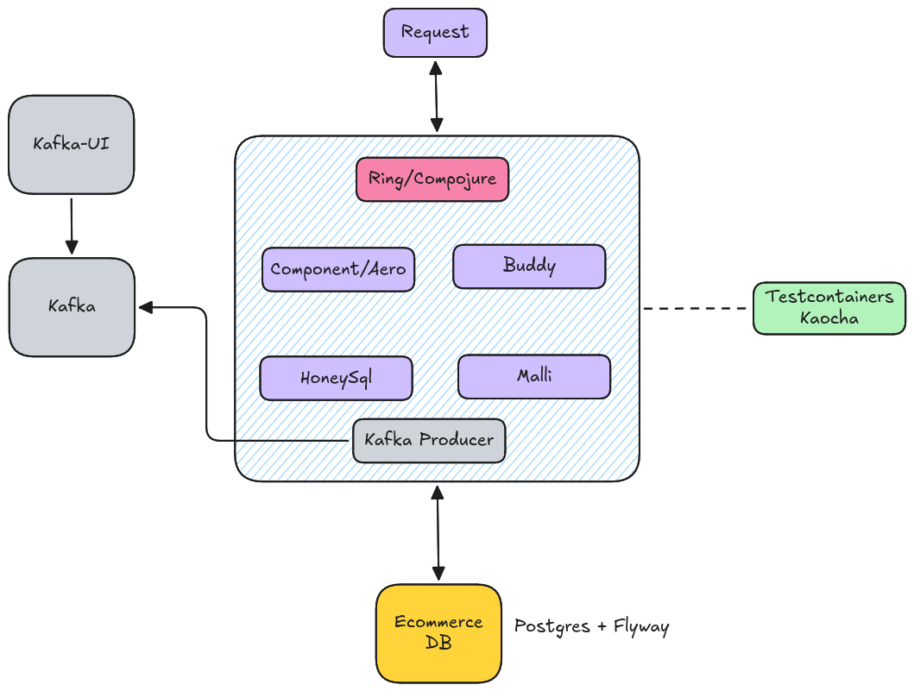

## Ecommerce
A Clojure monolithic ecommerce backend built with Component, Ring, Compojure, Malli, and HoneySql, featuring Kafka 
event streaming, Postgres persistence with Flyway migrations, JWT auth via Buddy, and AWS SES email delivery.



## Start app local
Make sure Docker Compose is installed.
```bash
docker-compose up -d
```

## Test (Kaocha)
Make sure [clj](https://clojure.org/guides/install_clojure) is installed:
```bash
clj -M:test :integration
clj -M:test :unit
```

## Interactive REPL
1. Start a REPL and evaluate the content in `dev/dev.clj`
2. Run the following commands in the REPL (***OPTIONAL***: create a shortcut in EMACS-INTELLIJ-NEOVIM):
```clojure
(in-ns 'dev)
(component-repl/reset)
```

## Test app
1. Check de folder `http` to perform request on the app
2. In order to obtain a valid token to test against the endpoints, eval-file `src/ecommerce/utils/jwt.clj`
  - Local Port: 3000
  - Container Port: 8080
